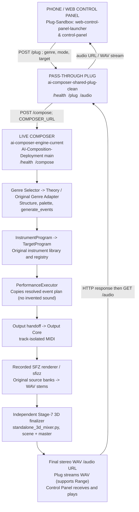
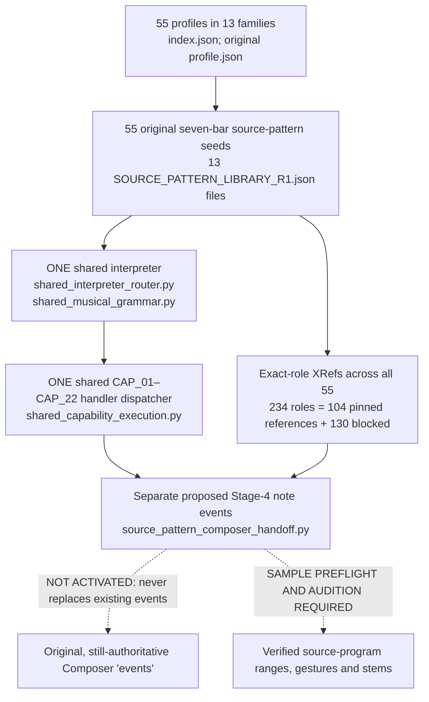

# VERIFIED CONNECTION MAP — AI COMPOSER WHOLE MACHINE
**Audit date/time:** October 9, 2026, 1:42 PM CDT (America/Chicago)
**Scope:** Control Panels, Plug, live Composer, all 55 genre programs, single shared interpreter, 22 capability handlers, recorded resources, SFZ/MIDI output, independent 3D mixer, and return to phone.
**Source baseline:** Frozen October 9, 2026 11:28 AM CDT hard-copy branch `hard-copy-ai-composer-2026-10-09-1128-CDT`, commit `352e2a4d9d13bbe9f8a76bd336488bae14e042ee`.
**This is an inspection map, not a new engine, production change, or playback certification.**

## Read the statuses
- **SOURCE VERIFIED:** Actual code call/read and/or saved automated source test confirms a connection on the named branch; says nothing about production.
- **LIVE OBSERVED:** Confirmed on Render service configuration or time-stamped logs; a past successful audio run, not an on-demand user listening test.
- **PREPARED / ISOLATED TEST PASS:** Data interface/adapter is built and tests passed on development branch; NOT live.
- **PARTIAL / BLOCKED:** One end exists but its dependent resource, stage promotion, or audio proof is not complete.
- **UNVERIFIED:** A specific runtime/permission/audio or version relation hasn't been demonstrated.

## Map A — Live Control Panel -> actual recorded audio

**What has actual live evidence?** Render's `ai-composer-shared-plug-clean` logs on **October 8, 2026** show a real `/plug` Jazz Ballad request and a self-test upstream `https://ai-composer-engine-current.onrender.com` that returned recorded Rock `audio_rendered:true`. Rock source programs were resolved to original Growlybass, Shinyguitar and individual Big Rusty drums, and separate stems showed measurable WAV peak/RMS; the Jazz Ballad relay also returned `audio_rendered:true` using Meatbass, Wurlitzer and original jazz brush sources. This is evidence of *earlier* full audio delivery, not that each of 55 genres works now or sounds good. The logged `COMPOSER_URL` is point-in-time evidence, not a guarantee the service's current environment is unchanged.

**Deployed-service references verified read-only via Render:** `ai-composer-web-control-panel` (static, `Plug-Sandbox/web-control-panel-launcher`), `ai-composer-control-panel` (static, `Plug-Sandbox/control-panel`), `ai-composer-shared-plug-clean` (web, `Plug-Sandbox/main`), `ai-composer-engine-current` (web, `AI-Composition-Deployment/main`). Other older service instances exist: do not silently route to `Portal4-Connection-Deployment` or any legacy Composer. **No Portal Four is part of the desired current route.**

### Exactly what each live link does

| ID | From -> to | Interface, source authority | Verification/status |
|---|---|---|---|
| L01 | Web Control Panel -> Plug | `web_launcher_index.html`: pinned `https://ai-composer-shared-plug-clean.onrender.com`, `POST /plug`, JSON `COMPOSER_INTERFACE_V1` | SOURCE VERIFIED (web UI), old live relay observed |
| L02 | Standard Control Panel -> Plug | `index.html`: defaults same Plug address but also permits override | SOURCE VERIFIED; which panel the phone is displaying must be confirmed during phone test |
| L03 | Plug -> Composer | `Plug-Sandbox/main/input_gateway.py`: `COMPOSER_URL`, forwards `/plug` or `/compose` to `/compose` | SOURCE VERIFIED + LIVE OBSERVED Oct 8 to engine-current |
| L04 | Plug health -> Composer health | Plug requires HTTP 200 and `BRIDGE_READY`; `render_server.py` delegates `/health` to original `input_gateway.Handler` (returns `BRIDGE_READY`) | Protocol SOURCE VERIFIED, current health not freshly probed |
| L05 | Composer HTTP -> engine | `composer_overrides/render_server.py` uses `input_gateway.Handler` -> `compose_request` -> `AICompositionEngine.run` | SOURCE VERIFIED |
| L06 | Engine -> original genre/theory | `engine.py`: `GenreSelector.select`, original `GenreExecutionAdapter.create_new`; normal-mode `build_setup` produces notes | SOURCE VERIFIED; Rock/Jazz historical live audio observed |
| L07 | Theory notes -> instrument/source registry | `InstrumentProgram.resolve_events` -> `TargetProgram.resolve`, `instrument_library.json`, `target_registry.json` | SOURCE VERIFIED; many genres unverified or resource-blocked |
| L08 | Resolved events -> performance executor | `PerformanceExecutor.execute` preserves event list and authority; earlier adapter has separate articulation/phrase logic | SOURCE VERIFIED; does not itself add human playing |
| L09 | Performance -> MIDI -> recorded stems | `output_handoff.py`: `build_execution_package` -> `OutputManager` MIDI; `preflight_audio_resources` and `execute_audio_render` -> `sfz_renderer_adapter.render_midi` per track | SOURCE VERIFIED, LIVE OBSERVED for Rock/Jazz (Oct 8) |
| L10 | WAV stems -> **standalone 3D** | `build_current_composer.sh` wraps `output_handoff` and invokes `standalone_3d_mixer.py` as distinct subprocess, using `spatial_master_handoff.finalize_real_stems` | SOURCE VERIFIED, historical audio returned; no generic built-in replacement |
| L11 | Final audio -> Plug -> browser | Engine `audio_render.audio_url`, server `/audio/...` ; Plug streams GET/HEAD with Range; Control Panel loads URL | SOURCE VERIFIED; actual phone speaker quality/playback not independently audited |

## Map B — new 55-genre musical intelligence (development branch, NOT live)

| ID | From -> to | Exact file/code evidence | Current verified state |
|---|---|---|---|
| D01 | Genre index -> 55 named original genre profiles | `genre_styles/index.json`, 13 family `profile.json` | PREPARED / TEST PASS: 55 and 13 asserted |
| D02 | Genre profiles -> individual musical patterns | 13 family `SOURCE_PATTERN_LIBRARY_R1.json`, `source_pattern_library.compile_original_source_seed` | PREPARED / TEST PASS: 55 distinct seven-bar scores, 4,371 note events |
| D03 | Stage 3 -> single shared genre interpreter | `shared_interpreter_router.route_to_shared_interpreter` in normal-mode `build_current_composer.sh` override | PREPARED / TEST PASS. No eighth stage or per-genre interpreter |
| D04 | Shared grammar -> 22 capability handlers | `compile_musical_plan` -> `evaluate_22_capabilities` | PREPARED / TEST PASS: dispatch exists for all; sound-dependent results intentionally blocked |
| D05 | Authored part -> recording identity | `source_pattern_resource_handoff.map_source_roles` + 13 `SOURCE_RESOURCE_BINDINGS_R1.json` | PREPARED: 234 roles inventoried: 103 EXACT_ID, 1 EXACT_CONTEXTUAL, 130 BLOCKED_UNVERIFIED. Pinned != sound-file preflight |
| D06 | Seed notes + exact source roles -> Stage 4 proposal | `prepare_source_pattern_composer_handoff`; attached as `developed['source_pattern_composer_handoff']` in build script | PREPARED / TEST PASS: Rock sample-identity fixture yields isolated candidate; no active event replacement |
| D07 | Proposed Stage-4 notes -> original active event stream | `developed['events']=events` still uses legacy `generate_events` | **NOT CONNECTED / DELIBERATELY BLOCKED** until source note ranges/stems, arrangement and audition pass |
| D08 | Candidate musical techniques -> exact SFZ articulation and correct MIDI | CAP_11–CAP_20, sample manifests, `instrument_gesture_handoff.py` | PARTIAL: symbolic states + some original Rock guitar control proof; universal real-instrument controls not proved |
| D09 | 55 separate MIDI previews -> live SFZ render | `research/export_55_original_genre_midi_previews_20261009.py`; Mido 1.3.3 | ISOLATED EXPORT PASS only. MIDI files are standalone research deliverables, not live score input |
| D10 | New genre audio -> Plug/phone verification | CAP_21, CAP_22 require actual recorded output/return receipt | BLOCKED / NOT VERIFIED for the new musical-intelligence route |

**Important:** These stages are *architectural* labels, while `engine.py` has an actual operational sequence: `GenreSelector -> Theory adapter produces events -> InstrumentProgram.resolve_events -> TargetProgram.resolve -> PerformanceExecutor.execute -> output MIDI -> individual SFZ stems -> 3D finalization`. Thus conceptual **Stage 3 (choose instruments) and Stage 4 (compose parts) are interleaved in the original runtime**. We should document that input/output contract rather than assume source pattern notes automatically inherit a selected sound.

## Seven stages and their present owners
| Stage | Intent | Current code owner / boundary | Integration status |
|---|---|---|---|
| 1 SELECT_GENRE | Choose exact named genre | `genre_selector.py` and original registry; new `index.json` | Live + 55 crossrefs, identity equivalence test still required |
| 2 DEFINE_MUSICAL_STRUCTURE | Tempo, meter, harmonies, sections | Original Theory adapter/engine; new chord timeline/source patterns | Live old / new proposal only |
| 3 CHOOSE_INSTRUMENTS_AND_DRUM_KIT | Source instrument palette | Original `build_setup`, `instrument_program.py`, `target_program.py`; new resource XRefs | Live for some old genres; 130 new roles blocked |
| 4 COMPOSE_SEPARATE_PARTS | Note events for individual instruments | Original `generate_events` and `develop_full_length`; new common source-pattern handoff | Live old; new event candidates unselected |
| 5 PERFORM_MUSICALLY | Physically plausible notes, expression and gestures | `instrument_performance_contract.py`, phrase/gesture bridges, `PerformanceExecutor` | Some Rock/Jazz implementations proven; 22 handler set not fully sounding |
| 6 RENDER_SEPARATE_AUDIO_STEMS | MIDI -> exact SFZ -> per-track WAV | `Output Core`, `sfz_renderer_adapter.py`, sample bank registry | Historical Rock/Jazz audio logs; new pattern notes untested |
| 7 GENRE_MIX_THEN_STANDALONE_3D_MIX | Combine only real stems into audited stereo output | `spatial_master_handoff.py`, distinct `standalone_3d_mixer.py`, `global_3d_output_gate.py` | Live old render route; no independent new-genre mix check |

## Interface discrepancies discovered in this audit (NOT another module wishlist)
1. **LIVE BRANCH DIVIDE** — Render `ai-composer-engine-current` auto-deploys **`AI-Composition-Deployment/main`**, not the Oct 9 frozen development branch. The latter was 156 commits ahead of `main` at this inspection. Do NOT merge or deploy blindly.
2. **EVENT AUTHORITY GAP** — `source_pattern_composer_handoff.candidate_stage4_events` never becomes `theory['events']`; the MIDI renderer only reads `theory['events']`. This is the specific new music-to-old renderer interface to design and verify after preflight, NOT evidence the interpreter is missing.
3. **130 UNMAPPED ROLES** — Need actual bank/program selection and note-zone preflight; 104 pinned references are not completed installed-program proof. Rock and Jazz Ballad live recordings already demonstrated in the older route; retain them.
4. **CONCEPTUAL/RUNTIME ORDER** — The original engine composes event data before `InstrumentProgram` and `TargetProgram` resolve it. Clarify per-stage data contracts before using the new instrument assignments; don't re-sequence functioning code solely for aesthetics.
5. **TUNING FIELD CONTRACT** — Both Control Panels send `tuning_reference_hz` (440/432) but the inspected original `input_gateway.compose_request` consumes only genre/target/mode and does not pass tuning to `AICompositionEngine.run`. No verified current music tuning behavior from that UI selection.
6. **TWO PANEL IMPLEMENTATIONS** — Both static sites point to the same clean Plug by default. `web_launcher_index.html` recursively accepts nested `audio_url` fields; `index.html` deliberately accepts only the final 3D mix with HTTP HEAD verification. Confirm which app the phone uses and harmonize final-audio acceptance before making claims of identical playback.
7. **HEALTH IS NOT FULL MUSIC** — Plug expects `BRIDGE_READY` from upstream `/health` and responds `COMPOSER_READY` to the launcher. Passing this validates HTTP routing, not 55 sound libraries or real playback.
8. **UNVERIFIED TODAY** — No live action/sound/phone listening test was run in this audit; latest concrete live-audio evidence is October 8 Render logs. Current services were read/configured only, not redeployed.

## First integration sequence (no additional interpreter)
1. **Freeze reference:** retain dated original hard copy `352e2a4...`. Make every change on a new development branch; no production changes without approval.
2. **Reconcile interface definitions:** one truth for genre name/profile ID, exact Stage-3 selected source ID, physical note range, percussion mapping, and role-to-track identity.
3. **Rock only, isolated:** feed new proposed Rock notes through exact source validation (installed SFZ, sample graph, note keys, program-specific articulation) while preserving legacy output, then generate *separate* trial recorded stems.
4. **Validate Stage 5 & 6:** original instruments, bass sustain, lead vibrato, kick/snare/tom separation, safe polyphony; measure each WAV and compare to preserved live Rock.
5. **Confirm Stage 7 and phone:** independent 3D mixer, final derivative URL, Plug HEAD/GET, correct panel readiness & actual device playback; no false first-stem substitute.
6. **Repeat by genre:** newly verified program mappings, authored music, and per-genre final audition; don't blanket activate remaining 55 based on Rock.

## Evidence and reproducibility
- Hard-copy Git commit: `352e2a4d9d13bbe9f8a76bd336488bae14e042ee` (complete 289-file source snapshot archive is downloadable in existing hard-copy artifact).
- Source-pattern execution / 55 check: https://github.com/mreeves1257-glitch/AI-Composition-Deployment/actions/runs/37956128952
- Guarded 55 resource-mapping / Stage4 handoff: https://github.com/mreeves1257-glitch/AI-Composition-Deployment/actions/runs/37957550347
- MIDI preview export: https://github.com/mreeves1257-glitch/AI-Composition-Deployment/actions/runs/37958964330
- Full source hard-copy build: https://github.com/mreeves1257-glitch/AI-Composition-Deployment/actions/runs/37959471987
- Separate actual service configuration read from Render October 9 (without making a deployment): `srv-db39lqjbc2fs73d2c6dg`, `srv-db2msoid0e5s73bmvrcg`, `srv-db2p5v67bikc73afmsp0`, `srv-db2qshad0e5s73e3e1pg`.
- Source of Plug/UI separate repo: `mreeves1257-glitch/Plug-Sandbox`, branches `main`, `control-panel`, `web-control-panel-launcher`.
- Live observation: `ai-composer-shared-plug-clean` app logs dated Oct 8, specifically `PLUG SELFTEST` upstream current Composer returned Rock rendered audio, and `PLUG RELAY` Jazz Ballad returned recorded stems + final output.
- GitHub code comparison, `main...hard-copy-ai-composer-2026-10-09-1128-CDT`: ahead 156 commits, behind 0, 163 changed files.

**CONTROLLED STOP:** This connection map describes real code/services and known gaps. No live 55-pattern audio activation, extra stage/interpreter, reintroduction of Portal Four, private instrument bank upload, Render deploy or destructive file change occurred.
